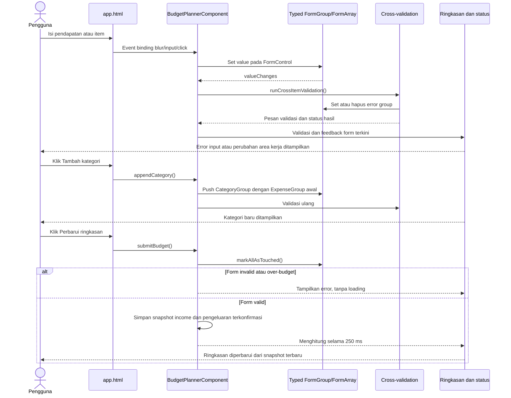

# Sequence Diagram Dynamic Multi-Input dan Cross-Validation

Alur ini menggambarkan interaksi pada browser. Tidak ada request backend atau database.

```mermaid
sequenceDiagram
  actor Pengguna
  participant Template as app.html
  participant Controller as BudgetPlannerComponent
  participant Form as Typed FormGroup/FormArray
  participant Validator as Cross-validation
  participant UI as Ringkasan dan status

Pengguna->>Template: Isi pendapatan atau item
  Template->>Controller: Event binding blur/input/click
  Controller->>Form: Set value pada FormControl
  Form-->>Controller: valueChanges
  Controller->>Validator: runCrossItemValidation()
  Validator->>Form: Set atau hapus error group
  Validator-->>Controller: Pesan validasi dan status hasil
Controller->>UI: Validasi dan feedback form terkini
UI-->>Pengguna: Error input atau perubahan area kerja ditampilkan

  Pengguna->>Template: Klik Tambah kategori
  Template->>Controller: appendCategory()
  Controller->>Form: Push CategoryGroup dengan ExpenseGroup awal
  Controller->>Validator: Validasi ulang
  UI-->>Pengguna: Kategori baru ditampilkan

  Pengguna->>Template: Klik Perbarui ringkasan
  Template->>Controller: submitBudget()
  Controller->>Form: markAllAsTouched()
  alt Form invalid atau over-budget
    Controller-->>UI: Tampilkan error, tanpa loading
  else Form valid
    Controller->>Controller: Simpan snapshot income dan pengeluaran terkonfirmasi
    Controller-->>UI: Menghitung selama 250 ms
    UI-->>Pengguna: Ringkasan diperbarui dari snapshot terbaru
  end
```
