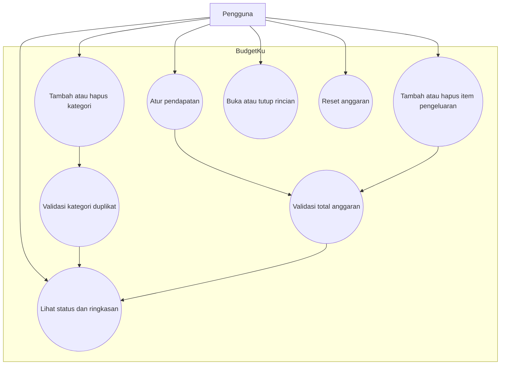

# Use Case Diagram

Dokumen ini adalah sumber diagram yang dapat dirender ke PNG atau PDF menggunakan Mermaid. Diagram menunjukkan aplikasi non-CRUD tanpa aktor backend.

```mermaid
flowchart TB
  actor[Pengguna]
  subgraph budgetku[BudgetKu]
    income((Atur pendapatan))
    category((Tambah atau hapus kategori))
    expense((Tambah atau hapus item pengeluaran))
    duplicate((Validasi kategori duplikat))
    over((Validasi total anggaran))
    state((Lihat status dan ringkasan))
    collapse((Buka atau tutup rincian))
    reset((Reset anggaran))
  end
  actor --> income
  actor --> category
  actor --> expense
  actor --> state
  actor --> collapse
  actor --> reset
  income --> over
  category --> duplicate
  expense --> over
  duplicate --> state
  over --> state
```
